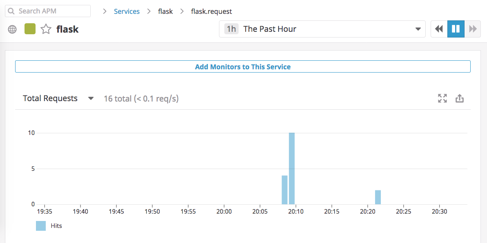
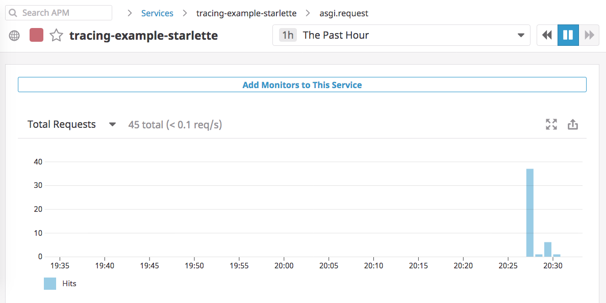

# tracing-example

Example applications for trying out [Datadog APM](https://docs.datadoghq.com/tracing/).

## Examples

To run these examples (without having to deploy to a cloud host), make sure you have the Datadog Agent installed and running locally. (Personally, I installed the Agent on my Mac following the instructions [here](https://docs.datadoghq.com/agent/basic_agent_usage/osx/?tab=agentv6).)

Traces may take a few minutes to show up in the [APM UI](https://app.datadoghq.com/apm/services).

### Flask

```bash
ddtrace-run python -m apps.flask
```



### ASGI

(e.g. Starlette.)

```bash
ddtrace-run uvicorn apps.starlette:app
```



## How it works

The Flask application, which is taken from the [Tracing Quickstart guide](https://docs.datadoghq.com/getting_started/tracing/), is auto-instrumented by [`dd-trace-py`](https://docs.datadoghq.com/getting_started/tracing/#create). Running with `ddtrace-run ...` automatically patches `flask`, which has the effect of sending traces to Datadog on each HTTP request.

The ASGI application is instrumented via the `TraceMiddleware` provided by [ddtrace-asgi](https://github.com/florimondmanca/ddtrace-asgi). It, too, sends traces to Datadog on each HTTP request made to the application.
